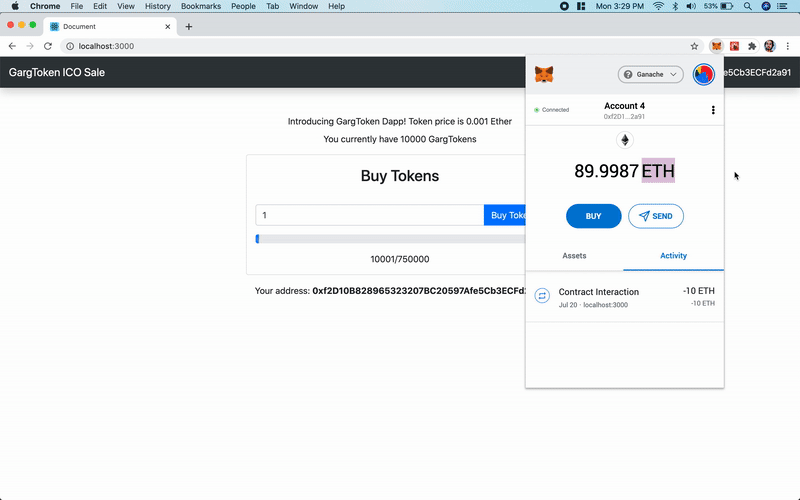

# GargToken

## An ERC-20 Token ICO Sale

#### Working:

#### About GargTokenSale Contract

- Functions Included:
  - admin
  - tokenContract
  - tokenPrice
  - tokensSold
  - buyTokens
  - endSale

#### About GargToken Contract

- Token Name: GargToken
- Token Symbol: Garg
- Token Standard: Garg Token v1.0
- totalSupply: \<passed by the owner\>
- Functions Included:
  - balanceOf
  - transfer
  - approve
  - allowance
  - transferFrom
  - name
  - symbol
  - standard
  - totalSupply
- Events Include:
  - Transfer
  - Approval

###### \*used solidity compiler version 0.5.0
